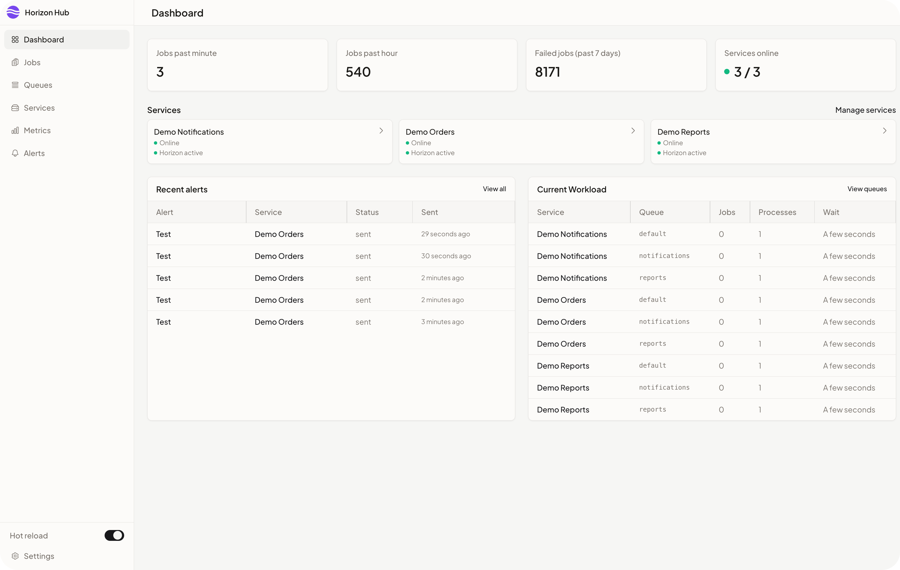

<p align="center">
  
</p>

# Introduction

Centralized dashboard for monitoring Laravel Horizon jobs across multiple services. Provides real-time metrics, job management, and alerting.

<p align="center">
  
</p>

## Features

- **Everything in one place**: monitor all your Horizon services from a single dashboard
- **HTTP-based integration**: configure each service's Horizon HTTP API endpoint in Horizon Hub
- **Act fast under pressure**: retry, inspect, and manage jobs without switching tools
- **Stay informed proactively**: receive timely alerts when reliability or performance drops

## Requirements

The recommended setup is **MySQL 8 + Redis**: both handle concurrent writes from the SSE streams and the queue/scheduler workers optimally. The [docker-compose.yml](docker-compose.yml) provides them for you, so you never configure them by hand.

To run from source instead of Docker, see the [manual install](docs/DEVELOPMENT.md) (PHP 8.4+, Composer, Node.js, and MySQL/SQLite or Redis).

## Quick start (recommended: MySQL + Redis)

Prebuilt multi-architecture images are published to Docker Hub on every release (tagged `latest` plus the semver version). Pull the ready-to-run compose stack (no clone, no build):

```bash
mkdir horizonhub && cd horizonhub
curl -o docker-compose.yml https://raw.githubusercontent.com/enegalan/horizonhub/main/docker-compose.yml
echo "APP_KEY=$(openssl rand -base64 32)" > .env
docker compose up -d
```

Open http://localhost — the root path redirects to `/horizon`. The container entrypoint runs the migrations and starts the queue and scheduler workers automatically. MySQL and Redis run inside the stack, so there is nothing to configure. To pin a version, change `enegalan/horizonhub:latest` to e.g. `enegalan/horizonhub:1.0.0` in `docker-compose.yml`.

Prefer your own databases? Point the `DB_*` (MySQL) and `REDIS_*` variables at your services and drop the compose `mysql`/`redis` services.

## Quick test (zero-config: no MySQL/Redis)

For a quick test or a simplified deploy without external services, extend the published image with a **minimal Dockerfile** — it runs standalone on the embedded SQLite fallback. Generate a stable `APP_KEY` once and reuse it via an ignored `.env` file. For real workloads prefer the full MySQL + Redis stack above.

```dockerfile
FROM enegalan/horizonhub:latest
```

```bash
echo "APP_KEY=$(openssl rand -base64 32)" > .env
docker build -t my-hub .
docker run -d -p 80:80 --env-file .env \
  -v horizonhub_storage:/var/www/html/storage \
  -v horizonhub_sqlite:/var/www/html/database \
  my-hub
```

The SQLite database persists in the `horizonhub_sqlite` volume; keep the same `APP_KEY` across recreations so encrypted data stays readable.

## Configuration

- **Database**: MySQL 8 (recommended) via `DB_*`; SQLite fallback for zero-config runs
- **Redis**: `REDIS_*` for cache/sessions (recommended for multistreaming workloads)
- **Alerts**: configure SMTP (`MAIL_*`) and/or Slack webhooks in alert rules

## Testing and code style

```bash
composer test
```

Formatting (Laravel Pint):

```bash
./vendor/bin/pint
```

## License

MIT
