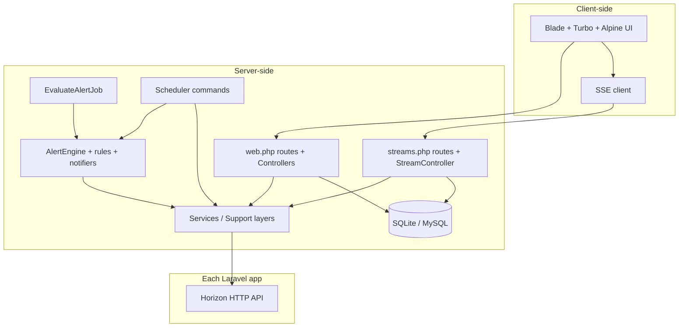

# Horizon Hub — Architecture

This document describes the internal architecture of Horizon Hub for developers, contributors and AI agents. For the product overview, key concepts, and feature map, see [HORIZONHUB.md](HORIZONHUB.md). For coding and testing conventions, see [CONVENTIONS.md](CONVENTIONS.md). For the local development workflow, see [DEVELOPMENT.md](DEVELOPMENT.md).

## Overview

Horizon Hub monitors remote [Laravel Horizon](https://laravel.com/docs/horizon) instances. It does not run queues or workers: it reads each service's existing Horizon HTTP API and proxies actions such as job retry.

## High-level structure




## Directory layout

```
app/
  Console/Commands/          hh:evaluate-alerts, hh:mark-stale-services-offline
  Http/
    Controllers/Horizon/     Page and action controllers
    Controllers/Stream/      HorizonStreamsController + Builds*Streams traits
    Middleware/              RedirectFormToDrawer (form.drawer)
    Requests/Horizon/        Form Request validation classes
  Services/                  Domain services
    Alerts/                  AlertEngine, rules (strategy pattern), batch upsert
    Horizon/                 HorizonClientApiService, HorizonClientHttpService
    Jobs/                    Job list / retry orchestration
    Metrics/                 Metrics data + Calculators/
    Notifiers/               Slack, Discord, email notifiers (strategy pattern)
    Services/                Service filtering, test connection
  Support/                   Cross-cutting helpers and readers
    Horizon/                 MasterReader, StatsReader, ClientResponse
    Alerts/                  Rule catalog, evaluation, delivery log presenter
    Http/                    HttpRetryBackoff
    Jobs/                    JobsPaginator, JobRuntime
    Queues/                  QueueNameNormalizer
    Services/                ServiceTagNormalizer
    FormDrawer.php, FlashStatus.php, DatetimeBoundaryParser.php
  Jobs/EvaluateAlertJob.php  Queued, batchable alert evaluation
  Models/                    Service, Alert, AlertLog, NotificationProvider, ServiceHeader
  Providers/                 Application service providers
  Rules/                     Custom validation rules

config/horizonhub.php        Internal application configuration
database/migrations/         Migrations; database/migrations + factories + seeders
resources/                   Blade views, CSS, JS (Alpine + Turbo + ECharts modules)
routes/
  web.php                    UI routes (prefix /horizon, name horizon.*)
  streams.php                SSE mirror routes (path /horizon/streams/horizon/*)
  console.php                Scheduler registration
tests/
  Unit/                      Service, strategy, calculator, model, helper tests
  Feature/                   Page and action tests
```


## Request paths


### Web (read) path

1. Browser hits `/horizon` (or one of the section routes in `routes/web.php`).
2. The controller loads data via services and returns a Blade view.
3. When hot reload is enabled, the layout also injects a stream endpoint URL and the client opens an SSE connection.

Controllers stay thin: they resolve request input (usually via a Form Request), delegate to the relevant service, and pass data to the view.

### Action path

POST/GET action routes (create, update, retry, evaluate, toggle) perform a service call, set a flash message via `FlashStatus`, and redirect. Create/edit GET routes are wrapped in the `form.drawer` middleware so that navigating to a form opens the drawer on the index page unless the request is a Turbo Frame.

### Job retry path

Horizon Hub retries jobs by reading a job's service and build from its ID, then POSTing to that service's Horizon retry endpoint (`config/horizonhub.php` → `horizon_paths.retry`). The proxy always uses the service's stored `headers`, and the dashboard session is used only for POST actions.

### Stream (SSE) path

- `routes/streams.php` declares a stream route that mirrors each section page, mounted with `SubstituteBindings`.
- `HorizonStreamsController` composes eight `Builds*Streams` traits; each trait renders `turbo-stream` fragments for the partials on its page.
- `StreamController` (the abstract base) deduplicates payloads by SHA-256 fingerprint per target so identical data does not re-emit redundant fragments.
- The client (`resources/js/lib/sse.js`) reconnects with backoff; `resources/js/lib/stream-guard.js` guards against stale/duplicate stream application.

Received `<turbo-stream>` fragments replace the matching fragment in the Blade `layouts/app` shell without a full page reload. Stream endpoints are excluded from the not-found redirect handling (see `bootstrap/app.php`).

## Horizon integration

- `HorizonClientHttpService` performs the actual HTTP calls against `base_url + /horizon/api`, applying the per-service headers and timeouts from `config/horizonhub.php`.
- `HorizonClientApiService` is the façade used across the app: workload, job lists, retry, metrics, masters, and stats.
- Readers in `app/Support/Horizon` (e.g. `MasterReader`, `StatsReader`) normalize API responses into `ClientResponse` objects; each response records its service id, so collectors can associate data back to the service.


### Resilience

- GET requests apply the configured retry policy for `429`, `502`, `503`, `504` (`horizon_http_retry`), with backoff from `Support\Http\HttpRetryBackoff`.
- Responses with status `401`, `403`, or `419` skip the failure cooldown, so fixing the service `headers` takes effect immediately; other failures set the service status to `unreachable` with a cooldown (`failure_cooldown_seconds`).
- Per-service concurrency is limited (`concurrent_requests`, `request_wait_microseconds`).


### Service status

- `hh:mark-stale-services-offline` (every minute) updates service and supervisor staleness using the `stale_service_minutes` and `dead_service_minutes` windows from `config/horizonhub.php`.
- A service can be `online`, `stand_by`, or `offline`; `enabled = false` excludes it from polling, metrics, and alert evaluation. The user-facing behavior of these states is described in the [HORIZONHUB.md FAQ](HORIZONHUB.md#why-does-a-service-show-stand-by-or-offline).


## Alert engine

Alert evaluation lives in `app/Services/Alerts`:

- `AlertEngine` orchestrates scheduled and manual evaluation.
- **Rule strategies** implement `AlertRuleStrategy` (registered in `AlertRuleStrategyRegistry`); the supported rule types and their UI labels are listed in [HORIZONHUB.md — Alert rule types](HORIZONHUB.md#alert-rule-types).
- Metrics come from the same Horizon integration layer used by the UI: RuntimeMetrics, WorkloadMetrics, FailureMetrics, JobsThroughput, JobsVolumeLast24h (in `app/Services/Metrics/Calculators`).
- Matched alerts are persisted (and resumed) by `AlertUpsertService` and written to `alert_logs`.
- **Delivery**: notifiers implement `AlertNotifier` (`SlackNotifierService`, `DiscordNotifierService`, `EmailNotifierService`, all extending `AbstractAlertNotifier`). Throttling and pending-state handling use `email_interval_minutes` and `horizonhub.alerts.pending_ttl_minutes`.
- Batch evaluation for multiple alerts is dispatched as `App\Jobs\EvaluateAlertJob` (batchable); the UI polls evaluation status.
- `hh:evaluate-alerts` runs every minute (via the scheduler, see `routes/console.php`).


## Configuration

The primary configuration file is `config/horizonhub.php`. It centralizes:

- Horizon API paths and timeouts/retries
- Reserved header names
- Failure cooldown and service staleness windows
- Per-service concurrency limits
- SSE hot reload interval
- Job list / UI page sizes and maximum Horizon pages
- Alert defaults (counts, seconds, minutes, pending TTL, delivery limits)

Most keys expose `HORIZON_HUB_*` environment overrides documented in that file. Avoid hardcoding operational values in services; read them from this config.

## Database

- Default local driver: SQLite; Docker/compose and CI demo: MySQL 8.0; Redis for cache/sessions in Docker.
- Tables: `services`, `alerts`, `alert_logs`, `notification_providers`, `alert_notification_provider` (pivot), `service_headers`, plus stock cache/queue/session tables. Auth tables were dropped (no auth by design).
- Migrations follow the date + 6-digit sequence convention; some are data migrations that normalize or backfill columns (e.g. `services.service_ids`, alert rule type consolidation).


## Scheduler

`routes/console.php` registers two commands, both `everyMinute()->withoutOverlapping()`:

- `hh:evaluate-alerts` — evaluates enabled alert rules.
- `hh:mark-stale-services-offline` — updates staleness and status of enabled services.

See [DEVELOPMENT.md — Running the application](DEVELOPMENT.md#running-the-application) for how to run the scheduler locally.

## Frontend architecture

- **Blade + Tailwind CSS v3** with a shadcn-style CSS-variable palette (`resources/css/app.css`, `tailwind.config.js`).
- **Hotwired Turbo** handles partial page updates, including frames (`data-turbo-frame`) used by the form drawer and tables.
- **Alpine.js** powers interactive components (drawer, toolbars, toggles, toasts).
- **ECharts** renders the metrics charts (`resources/js/charts/metrics-charts.js`).
- Vanilla ES modules under `resources/js/` grouped by concern (`horizon/`, `lib/`, `components/`).


## Deployment

- **Dockerfile**: `php:8.4-fpm-alpine` with nginx and PHP extensions; the entrypoint runs migrations, caches config, then starts `queue:work` and `schedule:work` alongside php-fpm and nginx.
- **docker-compose.yml**: hub + MySQL 8.0 + Redis 7.
- **demo/**: a separate compose stack that also runs three fake Horizon apps; usage in [DEVELOPMENT.md — Demo environment](DEVELOPMENT.md#demo-environment).
- **GitHub Actions** (`.github/workflows/ci.yml`) enforces the verification commands documented in [DEVELOPMENT.md — CI](DEVELOPMENT.md#ci).


## Related documents

- [HORIZONHUB.md](HORIZONHUB.md) — product overview and feature map
- [GUIDE.md](GUIDE.md) — end-user manual
- [CONVENTIONS.md](CONVENTIONS.md) — coding and testing conventions
- [DEVELOPMENT.md](DEVELOPMENT.md) — local setup and workflow
- [decisions/](decisions/) — accepted and rejected architecture decisions

