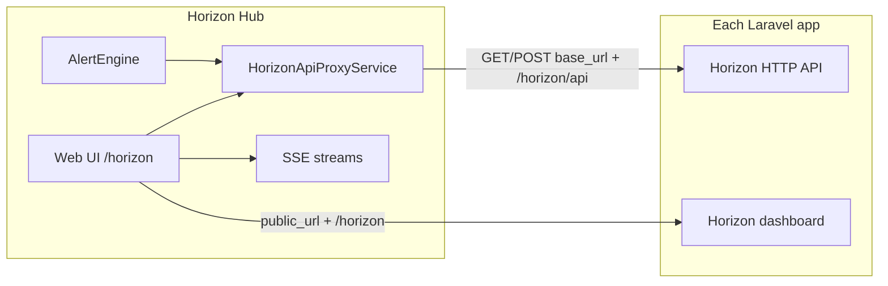

# Horizon Hub

Horizon Hub is a centralized web dashboard for monitoring [Laravel Horizon](https://laravel.com/docs/horizon) queue workers across **multiple** Laravel applications. From a single UI you can watch jobs and queues, inspect failures, retry work, review aggregated metrics, and receive alerts when reliability or performance degrades—without opening each service's Horizon dashboard separately.

For installation and environment setup, see the [README](../README.md). For step-by-step UI usage, see the [user guide](guide.md).

## Problems it solves

- **Fragmented operations**: teams running several Horizon instances lose time switching URLs, credentials, and mental context.
- **Slow incident response**: retrying and inspecting failed jobs requires jumping between tools; Horizon Hub unifies those actions.
- **Reactive firefighting**: failures, slow jobs, blocked queues, and offline workers or Horizon processes are easier to catch with configurable alert rules and Slack or email delivery.
- **Maintainable integration**: Horizon Hub talks to each app's **existing Horizon HTTP API** directly.

## What Horizon Hub is not

- **Not a replacement for Horizon** on each Laravel app. Horizon still runs queues, workers, and the per-app dashboard on every service.
- **Not a queue worker**. Horizon Hub does not execute jobs; it reads Horizon API data and proxies actions such as job retry.

## Key concepts

| Term           | Meaning |
|----------------|-------------------------------------------------------------------------------------------------------------------------------------------------------------------------------------------------------------------------------------------------------------|
| **Service**    | A registered remote Horizon instance: internal `base_url` for API calls, optional `public_url` for browser links, `tags`, optional HTTP `headers`, `enabled` flag, and health `status` (`online`, `stand_by`, `offline`). Stored in Horizon Hub's database. |
| **Provider**   | A reusable **notification channel** (Slack incoming webhook or email recipients), not a Laravel “service provider”. Alerts attach one or more providers.                                                                                                    |
| **Alert**      | A named rule scoped to services (and optionally queues/jobs) that evaluates conditions and sends notifications through providers.                                                                                                                           |
| **Hot reload** | Server-Sent Events (SSE) that push Turbo Stream HTML fragments to the open page so lists and KPIs update without a full reload. Toggle in the header toolbar.                                                                                               |

## Feature map

The main UI lives under `/horizon` (root `/` redirects there). Sidebar sections:

| Section   | Path                 | Role                                                                 |
|-----------|----------------------|----------------------------------------------------------------------|
| Dashboard | `/horizon`           | Cross-service KPIs, service health, recent alerts, workload snapshot |
| Jobs      | `/horizon/jobs`      | Processing, completed, and failed jobs across services               |
| Queues    | `/horizon/queues`    | Pending jobs per queue                                               |
| Services  | `/horizon/services`  | Register and manage Horizon endpoints                                |
| Metrics   | `/horizon/metrics`   | Charts and tables for throughput, failures, runtimes, queue wait     |
| Alerts    | `/horizon/alerts`    | Alert rules, evaluation, delivery history                            |
| Providers | `/horizon/providers` | Slack and email notification destinations                            |

## Integration requirements

Each **remote Laravel application** must already run Horizon with its HTTP API reachable from Horizon Hub host.

### Horizon URLs (defaults)

Configured in `config/horizonhub.php` under `horizon_paths`:

| Purpose                             | Default path (relative to service URL) |
|-------------------------------------|----------------------------------------|
| Dashboard (browser)                 | `{public_url}/horizon`                 |
| API base                            | `{base_url}/horizon/api`               |
| Connectivity ping                   | `.../stats`                            |
| Workload, job lists, retry, masters | See `horizon_paths` in config          |

- **`base_url`**: URL Horizon Hub uses for server-side API calls (often internal).
- **`public_url`**: URL operators use in the browser; falls back to `base_url` if empty.

Custom paths can be adjusted in config if a deployment uses non-default Horizon mount points.

### Horizon Hub deployment

- **PHP 8.4+**, **Laravel 13**, database (MySQL 8 or SQLite), **Redis** (cache/sessions as configured).
- **Scheduler** must run Laravel's scheduler so these commands execute every minute (`routes/console.php`):
  - `hh:evaluate-alerts` — evaluate enabled alert rules
  - `hh:mark-stale-services-offline` — update service/supervisor staleness
- **Email alerts**: configure Horizon Hub `MAIL_*` in `.env` when using email providers.
- **Service health** (env overrides in config): `HORIZON_HUB_STALE_SERVICE_MINUTES` (default 5), `HORIZON_HUB_DEAD_SERVICE_MINUTES` (default 15).

Disabled services are excluded from polling, metrics, and alert evaluation.

## Architecture and data flow

### Read path (monitoring)

Controllers and services call `HorizonApiProxyService` to perform GETs (and POST for retries) against each enabled service's Horizon API. Metrics aggregation uses paginated job list endpoints with limits defined in `config/horizonhub.php` (`horizon_api_job_list_page_size`, `max_horizon_pages`).

### Alert path

1. **Scheduled**: `hh:evaluate-alerts` runs `AlertEngine::evaluateScheduled()` for all enabled alerts against enabled services.
2. **Manual (UI)**: “Evaluate” on one alert runs synchronously; “Evaluate all” queues per-alert jobs and polls evaluation status.
3. **Delivery**: matched rules notify attached providers (Slack webhook or email). Throttling and batching use `email_interval_minutes` on the alert and `horizonhub.alerts.pending_ttl_minutes` in config.

### Live updates (SSE)

Stream routes mirror UI paths under `/horizon/streams/horizon/...` (see `routes/streams.php`). The client (`resources/js/lib/sse.js`) connects when hot reload is enabled, receives Turbo Stream patches, and reconnects with backoff.

## Alert rule types

| Rule type (internal) | UI label                    |
|----------------------|-----------------------------|
| `failure_count`      | Failure count in window     |
| `avg_execution_time` | Avg execution time exceeded |
| `queue_blocked`      | Queue blocked               |
| `worker_offline`     | Worker offline              |
| `supervisor_offline` | Supervisor offline          |
| `horizon_offline`    | Horizon offline             |

Threshold fields vary by type (`count`, `seconds`, `minutes` in the `threshold` JSON). Optional queue and job patterns narrow scope for several rule types.

## Architecture decisions

Canonical records live under:

- [Accepted ADRs](decisions/accepted/)
- [Rejected ideas](decisions/rejected/)

Summary relevant to agents and contributors:

| Topic                             | Status                                                                          | Notes                                                          |
|-----------------------------------|---------------------------------------------------------------------------------|----------------------------------------------------------------|
| Direct Horizon HTTP API           | Accepted ([0001](decisions/accepted/0001-agent-removal.md))                     | No agent layer; integrate via Horizon Hub proxy and config     |
| Horizon API path hot-reload cache | Accepted ([0002](decisions/accepted/0002-horizon-api-hot-reload-path-cache.md)) | Path cache behavior for API integration                        |
| Built-in authentication           | Rejected ([0001](decisions/rejected/0001-authentication.md))                    | Trusted network model                                          |
| Route-level protection            | Rejected ([0002](decisions/rejected/0002-protect-routes.md))                    | Depends on auth model                                          |
| Caching Horizon service data      | Rejected ([0003](decisions/rejected/0003-cache-horizon-service-data.md))        | Do not propose a cache layer without reopen conditions         |

Do not suggest rejected alternatives unless a documented reopen trigger is met or the user explicitly asks to revisit the decision.

## Tech stack

| Layer           | Technology                                              |
|-----------------|---------------------------------------------------------|
| Backend         | PHP 8.4+, Laravel 13                                    |
| Frontend        | Hotwired Turbo (turbo-laravel), Alpine.js, Tailwind CSS |
| Testing / style | PHPUnit 12, Laravel Pint                                |
| Data            | MySQL or SQLite; Redis                                  |

Repository agent instructions: [AGENTS.md](../AGENTS.md).

## FAQ (for AI agents and contributors)

**How do I add a new Horizon instance to Horizon Hub?**
Register a **Service** with correct `base_url` (and `public_url` if different), optional auth headers, then use **Test connection**. See [guide.md — Connecting services](guide.md#connecting-services).

**How do alerts fire?**
The scheduler runs `hh:evaluate-alerts` every minute. Each enabled alert runs rule strategies in `AlertEngine` against enabled services. UI “Evaluate” triggers immediate or batched runs.

**Can Horizon Hub retry failed jobs?**
Yes. Horizon Hub POSTs to each service's Horizon retry endpoint (`horizon_paths.retry`), proxied per service and job UUID.

**Is there a login page?**
No application-level authentication. Access control is expected at the network or reverse-proxy layer.

**Why does a service show stand-by or offline?**
`last_seen_at` and connectivity drive status. After `stale_service_minutes` without signal, supervisors may be treated as stale; after `dead_service_minutes`, the service is marked offline. Disabled services do not poll.

**Where is Horizon Hub configuration?**
Primary file: `config/horizonhub.php`. Many keys have `HORIZON_HUB_*` env overrides documented in that file (timeouts, retries, job page sizes, alert defaults).

**What HTTP statuses does the proxy treat specially?**
`401`, `403`, `419` may trigger dashboard session retry flows; `429`, `502`, `503`, `504` may be retried on GET per `horizon_http_retry`.

**Does Horizon Hub cache remote Horizon data?**
Not as a separate agent/cache product decision—see rejected [IDEA-0003](decisions/rejected/0003-cache-horizon-service-data.md). Live UI updates use SSE patches, not a substitute for Horizon's own storage.

**What are Providers vs Services?**
**Services** are Horizon backends. **Providers** are notification destinations (Slack/email) linked to alerts.

**How do I help a user use the UI?**
Point them to [guide.md](guide.md) section by section (Dashboard → Services → Providers → Alerts → Jobs/Queues/Metrics).

**Where are routes defined?**
Web UI: `routes/web.php`. SSE: `routes/streams.php`.

## Related documentation

| Document | Audience |
|----------|----------|
| [README.md](../README.md) | Install, requirements, quick start |
| [guide.md](guide.md) | End-user manual for all features |
| [decisions/](decisions/) | Accepted and rejected architecture decisions |
| [AGENTS.md](../AGENTS.md) | Coding and testing conventions for agents |
